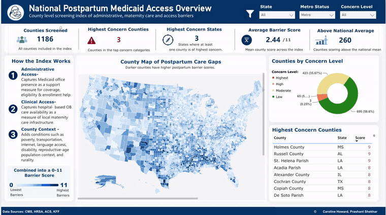
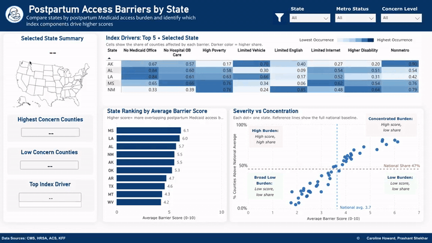
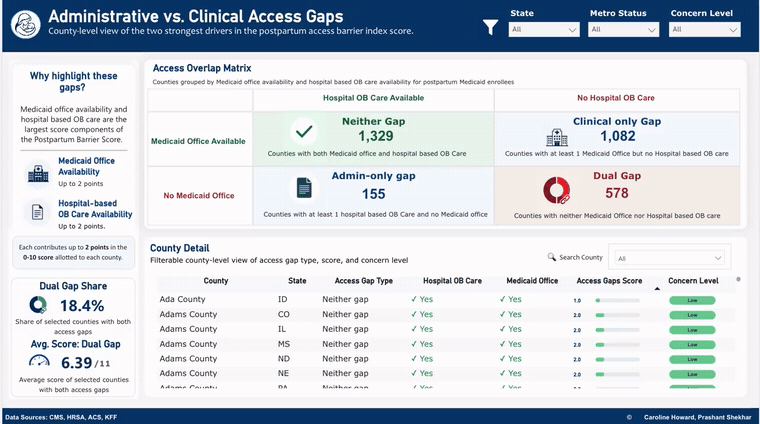

# Postpartum Medicaid Access Barrier Index

[Live dashboard preview and findings brief](https://caroline-howard.github.io/medicaid-access-barriers-powerbi/)

## Dashboard Preview

County-level postpartum Medicaid access barrier index identifying where postpartum Medicaid populations may face greater administrative access barriers after delivery. The project combines geocoded Medicaid office locations, county-level demographic and access indicators, rural-urban context, and hospital-based obstetric care status, then presents the index through an interactive Power BI dashboard.

## Main Research Question

Where may postpartum Medicaid populations face greater administrative access barriers to maintaining coverage and navigating support after delivery?

## Project Purpose

This project develops a transparent county-level screening index for postpartum Medicaid administrative access barriers. It uses geocoded Medicaid office locations, county-level ACS indicators, rural-urban context, and hospital-based obstetric care status to identify counties where limited office availability overlaps with postpartum-relevant access barriers.

The main contribution is the Potential Postpartum Medicaid Administrative Access Barrier Index. The Power BI dashboard serves as the reporting and exploration layer for communicating the index, comparing counties and states, and identifying places that may warrant closer review, outreach, resource planning, or access-support prioritization.

The dashboard distinguishes Medicaid office availability as administrative and enrollment support access from hospital-based obstetric care status as clinical maternity access context.

## Data Sources

- Shafer et al. 2024 geocoded Medicaid office locations dataset from Harvard Dataverse
- U.S. Census cartographic county boundaries
- American Community Survey 2024 5-year county-level indicators
- NCHS 2023 Urban-Rural Classification Scheme for Counties
- University of Minnesota Rural Health Research Center county-level hospital-based obstetric care status

## Main Analytic Contribution: Potential Postpartum Medicaid Administrative Access Barrier Index

The index is a transparent, reproducible county-level score designed to summarize overlapping postpartum Medicaid administrative and access-support barriers. It is calculated from documented public data sources and keeps each component available for interpretation in Power BI.

Score components:

- No Medicaid office in county = 2 points
- No hospital-based obstetric care = 2 points
- Top quartile poverty rate = 1 point
- Top quartile no-vehicle household rate = 1 point
- Top quartile no-internet subscription rate = 1 point
- Top quartile limited English rate = 1 point
- Top quartile disability rate = 1 point
- Nonmetro county = 1 point

Score range: 0-10 points

Concern levels:

- 0-2 = Lower concern
- 3-5 = Moderate concern
- 6-8 = High concern
- 9-10 = Highest concern

Population age 65+ is not included in the score or dashboard context because this project is focused on postpartum Medicaid access barriers. Disability rate remains included as a county-level access-support context measure, not as a direct measure of postpartum disability or pregnancy-related disability. Female population ages 15-44 is retained as postpartum-relevant ACS context, but it is not included as a scoring component in the dashboard index.

## Data Source Setup

The primary data source is the Shafer et al. 2024 geocoded Medicaid office locations dataset from Harvard Dataverse. The raw Excel file should be saved locally as `data/raw/medicaid_offices.xlsx`.

Raw data should remain unchanged. Cleaning, county spatial joins, postpartum-relevant access-barrier measures, and export-ready tables will be handled by scripts. This documentation step does not add new data or perform index calculations.

## Current Data Pipeline

1. Raw Medicaid office Excel file: `data/raw/medicaid_offices.xlsx`
2. Clean Medicaid office CSV: `data/processed/medicaid_offices_clean.csv`
3. County-assigned Medicaid office file: `data/processed/medicaid_offices_with_county.csv`
4. Complete county office access base table: `data/processed/county_office_access_base.csv`
5. ACS county access-barrier indicators, including female population ages 15-44: `data/processed/county_office_access_with_acs.csv`
6. NCHS rural-urban classification: `data/processed/county_office_access_with_acs_rurality.csv`
7. Hospital-based obstetric care status: `data/processed/county_postpartum_access_analytic_base.csv`
8. Potential Postpartum Medicaid Administrative Access Barrier Index: `data/processed/county_postpartum_access_index.csv`
